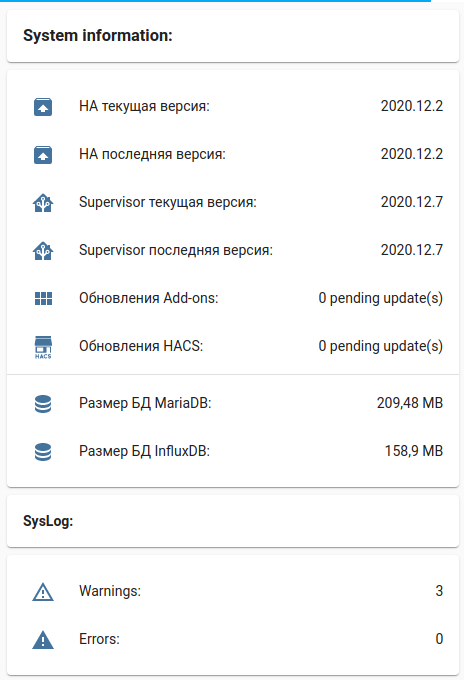
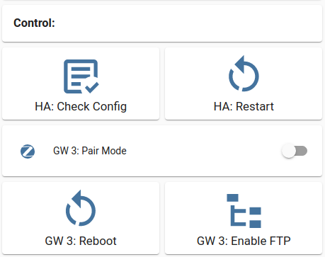

## Here you can find some screenshots from my HA interface
Most of the pages are prepared for easy use both on desktop and mobile apps.

**Climate**\

**Lights**\

**Vacuum cleaner**\

**Water leakage control**\

**Some statistics**\

**Xiaomi Gateway 3 Radio Stats**\

|**System information**|**Some system controls**|
|---|---|
|||