## Here you can find some screenshots from my HA interface
Most of the pages are prepared for easy use both on desktop and mobile apps.\
I use vertical and horizontal stack to organize cards in one vertical ribbon in mobile app.\
Big cards are very useful in both - mobile and desktop.

**Climate**\
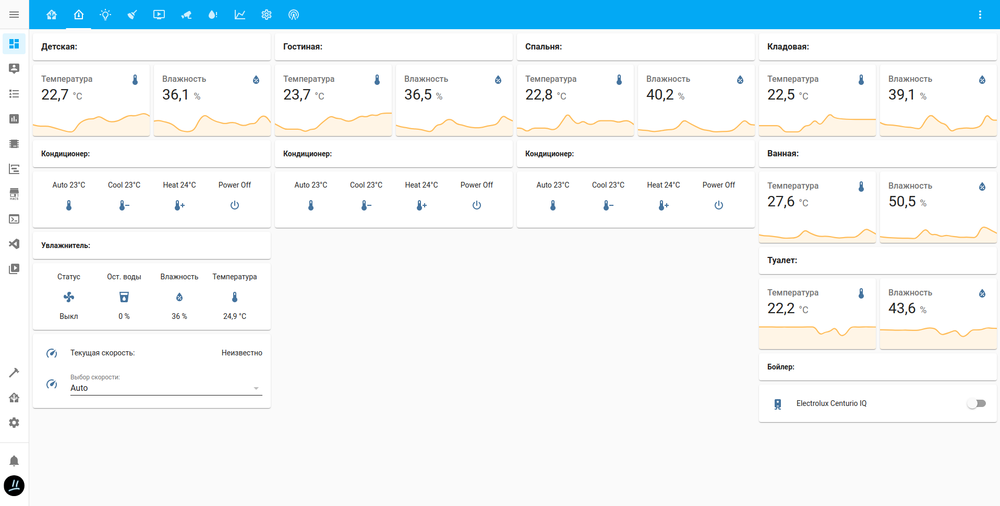

**Lights**\
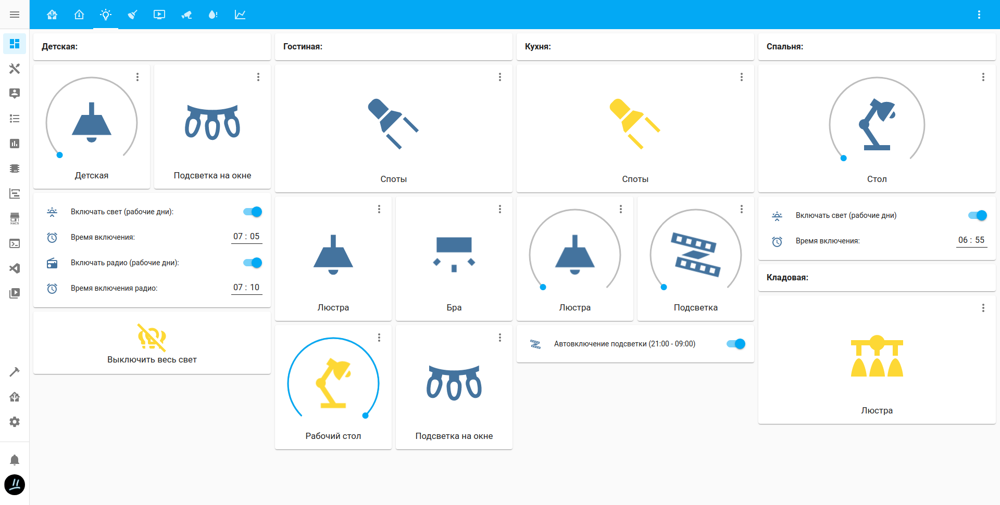

**Vacuum cleaner**\
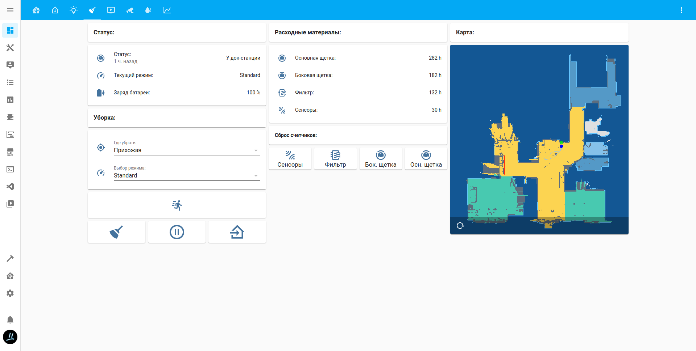

**Media players**\
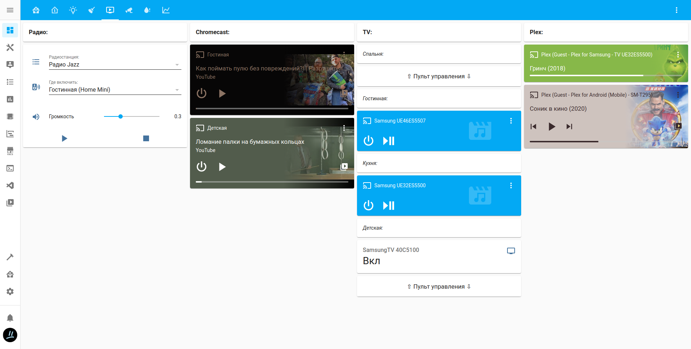

**Cameras**\
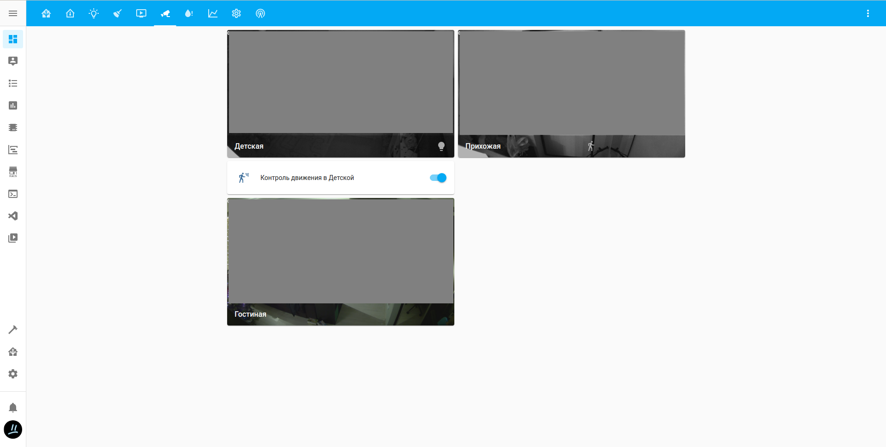

**Water leakage control**\
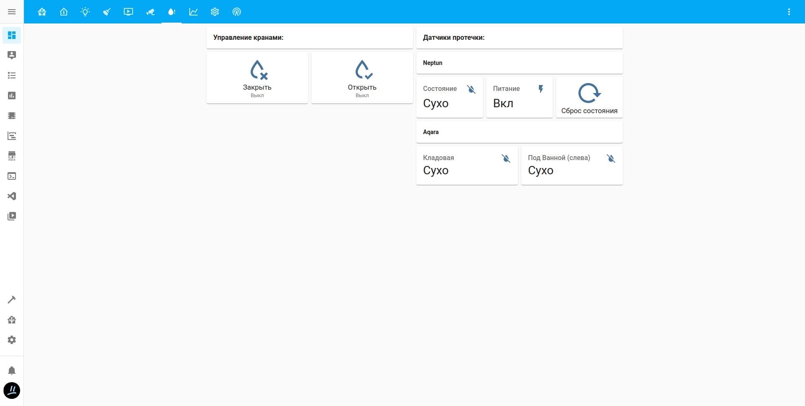

**Some statistics**\
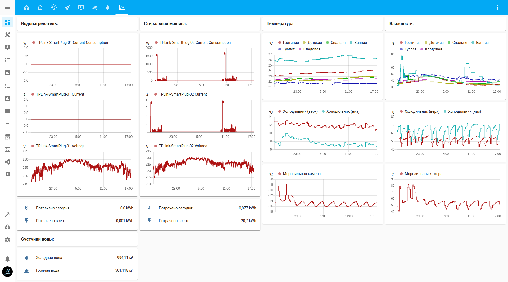

**Some system controls**\
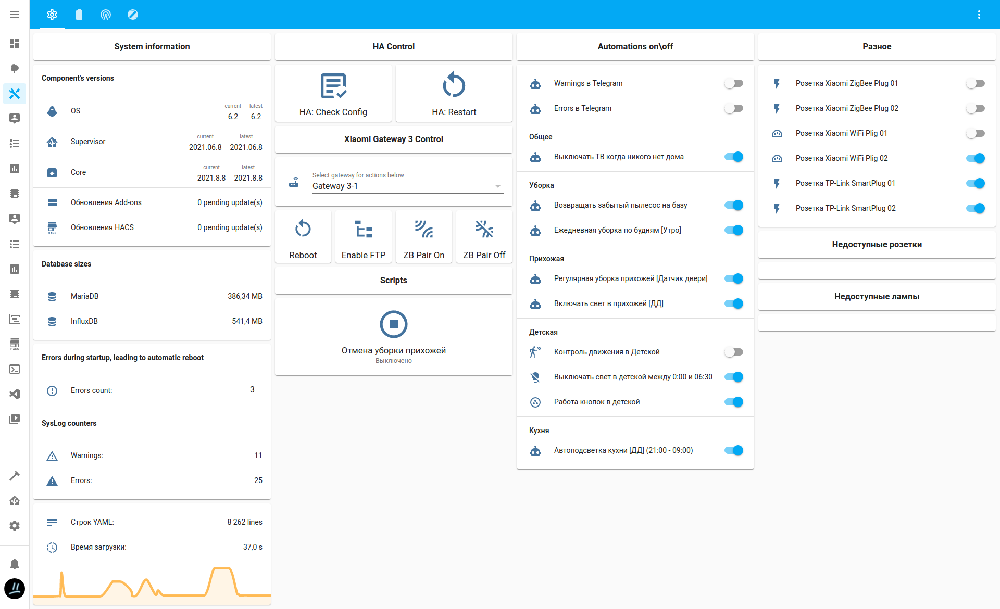

**Xiaomi Gateway 3 Radio Stats**\
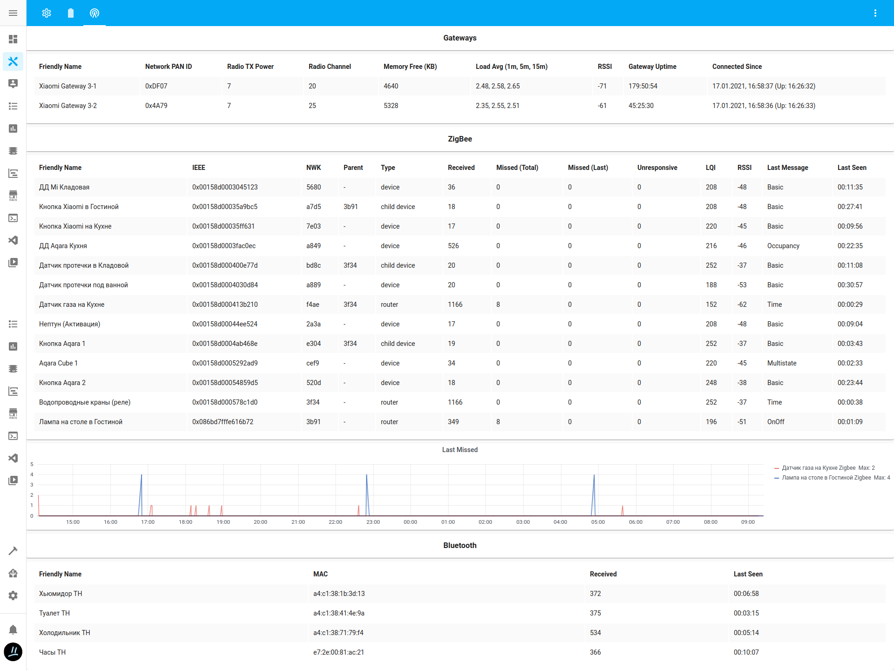

**Mobile App Look**
|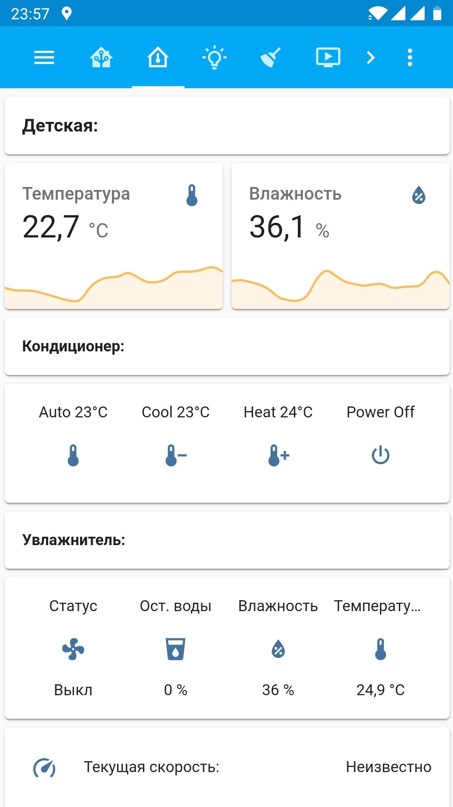|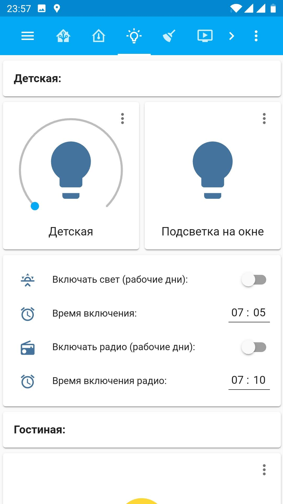|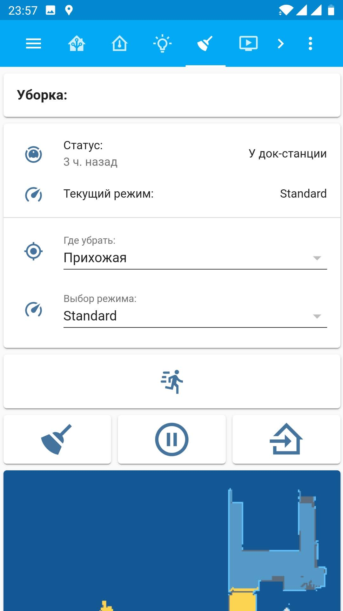|
|---|---|---|
|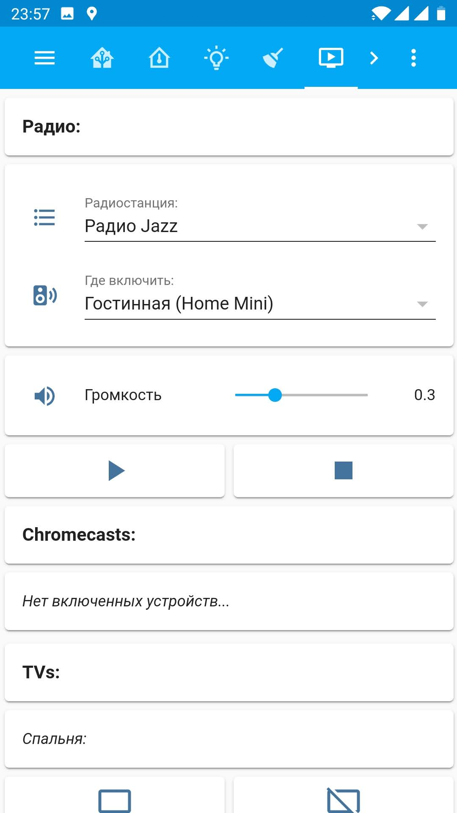|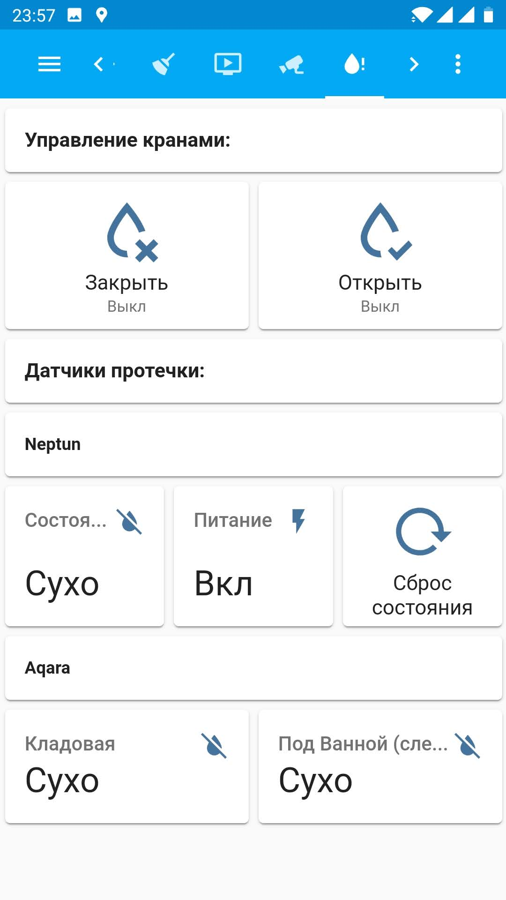|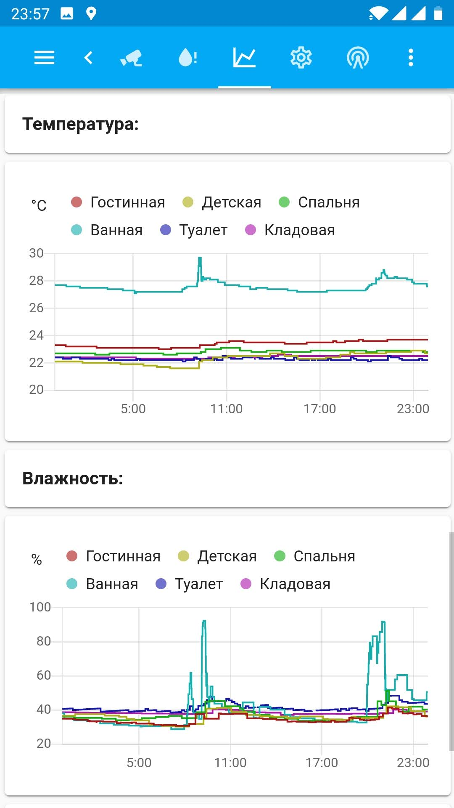|